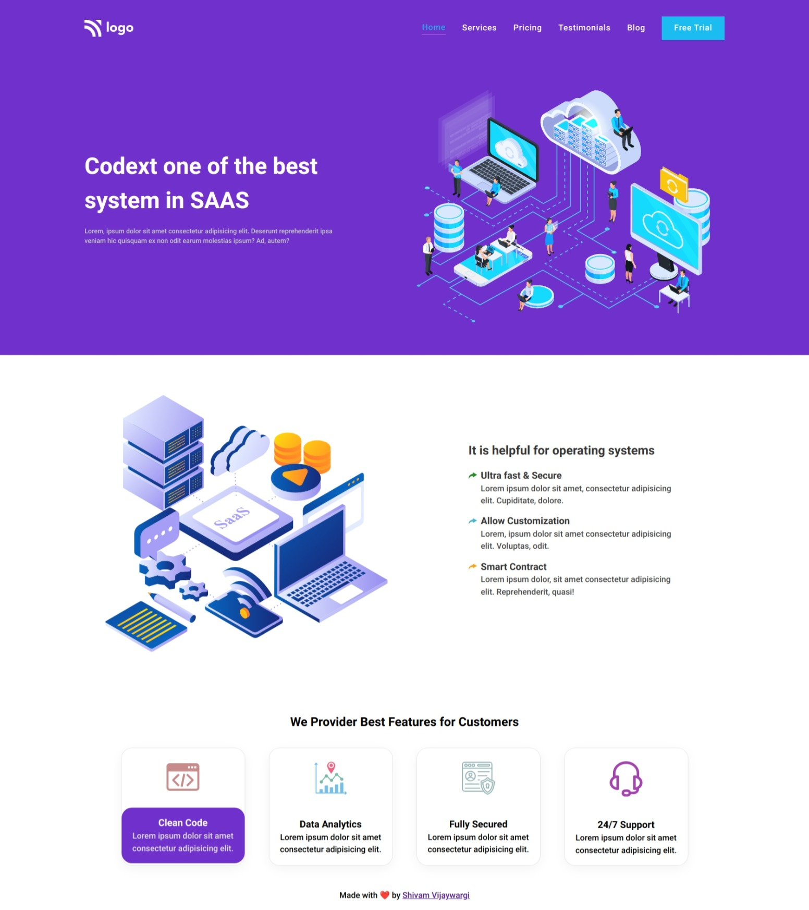

# SAAS Landing

> Project 13

<table>
<tr>
<td>
  A landing page designed using pure HTML & CSS.
</td>
</tr>
</table>

### Skills Gained from this

- Learned about CSS media queries and used Mobile First approach which is popular and recommended.

### Screenshot

## Device support

The site is compatible with almost all screen sizes except for watches.

## Author

